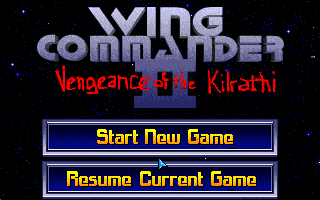
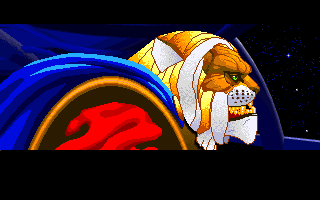
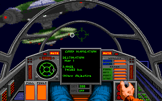
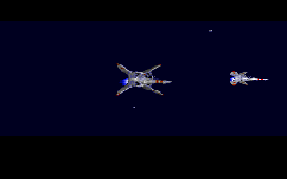
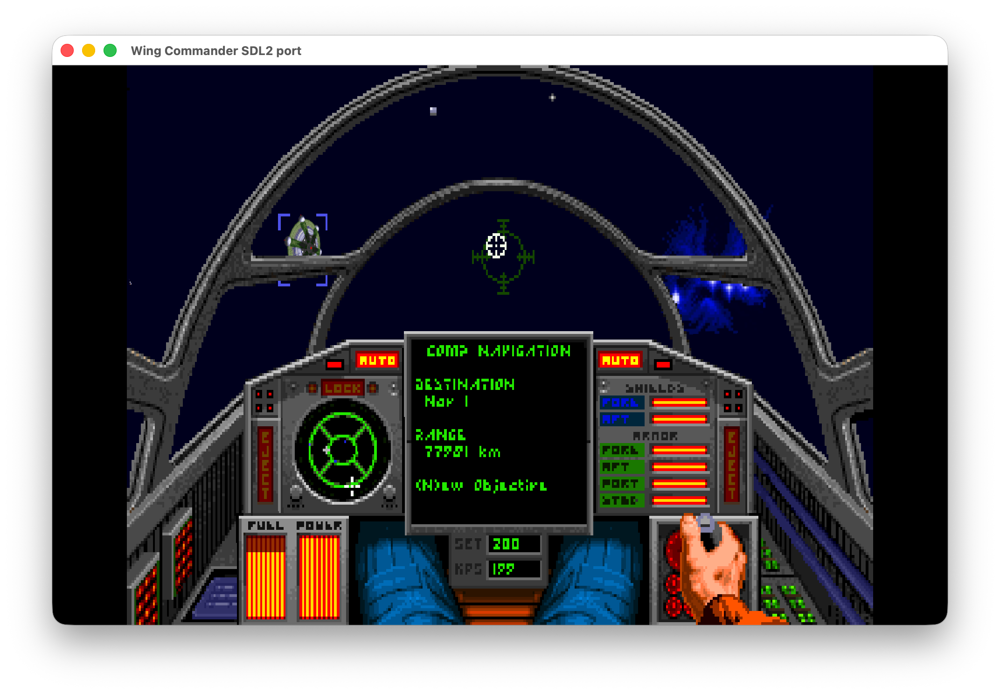
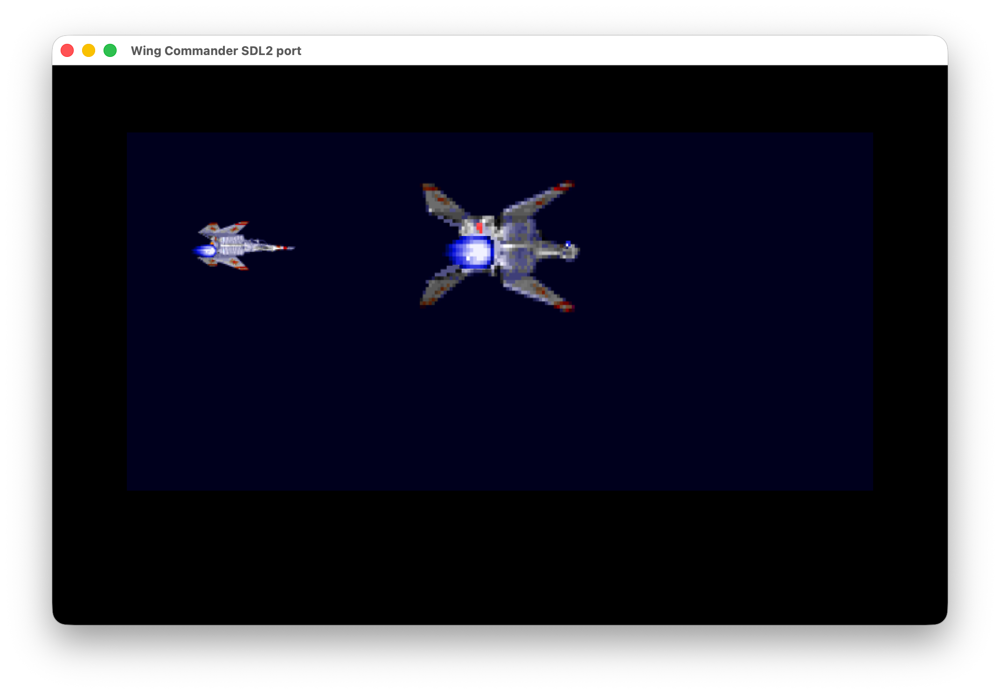

# Wing Commander II source reconstruction and SDL2 port

This project recreates the source of **Wing Commander II** as shipped in *Wing
Commander: The Kilrathi Saga* (1996). The reconstructed game core is C, the
`ix` audio library is C++, and the reference build uses Microsoft Visual C++
4.1 under [`wibo`](https://github.com/neuromancer/wibo) to reproduce the
original Win32 `WC2.EXE`.

A native SDL2 port is available for Windows, Linux, and macOS. It supports
Kilrathi Saga data and has partial support for the original DOS game data.

No retail game data files are included.

## Status

The reconstruction is incomplete: the source compiles and links as `WC2.EXE`,
but significant implementation, mapping, and runtime work remains. `make
report` compares 1,575 functions against the retail executable and averages
98.06% machine-code similarity, which measures reconstruction fidelity, not
gameplay completeness.

The SDL2 port runs the title sequence, campaign intro, pilot database,
save/load menus, cutscenes, and spaceflight, including firing, targeting,
cockpit displays, and music. A DOS install plays its own AdLib music and
synthesized OriginFX sound effects instead of the Kilrathi Saga streams and
waves. The optional OpenGL renderer redraws space objects at output resolution
while retaining the original indexed cockpit, HUD, and palette effects.

## Screenshots

Captured through DREAMM at the game's original 320x200 resolution.

| Title menu | Opening sequence |
| --- | --- |
| [](screenshots/title-screen.png) | [](screenshots/kilrathi-intro.png) |

| Cockpit navigation | External flight sequence |
| --- | --- |
| [](screenshots/cockpit-navigation.png) | [](screenshots/external-flight.png) |

## Download and run the SDL2 port

Download the archive for your platform from
[GitHub Releases](https://github.com/neuromancer/wc2-re/releases). Extract its
contents into an installed Kilrathi Saga or DOS Wing Commander II directory and
keep the bundled runtime libraries beside the executable. Start it with that
directory as the working directory:

```sh
# macOS or Linux
cd /path/to/WC2
./wc2-modern
```

```powershell
# Windows PowerShell
cd C:\path\to\WC2
.\wc2-modern.exe
```

### Fixes and features

The native port includes these fixes and optional features:

| Fix or feature | Enable with |
| --- | --- |
| Kilrathi Saga or DOS game data, detected automatically | always on |
| Original orchestral startup and logo sequence, when its data is present | always on |
| Original cinematic captions alongside Speech Pack dialogue | always on |
| Resizable window, fullscreen toggle, and mouse capture | always on |
| Aspect-correct 4:3 presentation and pointer mapping | always on |
| Mouse-wheel throttle control during spaceflight | always on |
| `Esc` pauses during spaceflight when communications are closed | always on |
| Pointer confined only during unpaused, focused spaceflight | always on |
| Automatic SDL gamepad mappings and hot-plug support | always on |
| Background planets drawn with their own sprite and scale (WCDX fix) | always on |
| Static on knocked-out cockpit displays | always on |
| OpenGL space objects rendered at output resolution | `--enhanced` |
| Heavy-weapon, damage, collision, and afterburner rumble | `--joystick-rumble` |
| WCAT-style four-button joystick layouts | `--joystick-mode=4button-2axis` or `4button-4axis` |
| Twin-stick, HOTAS, throttle, and rudder layouts | `--joystick-axes=<layout>` |
| Joystick diagnostics on stderr | `--joystick-debug` |
| Frame-rate counter | `-f` |
| Cockpitless view | `-c` |

Options can be combined:

```sh
./wc2-modern --enhanced --joystick-rumble \
  --joystick-mode=4button-4axis
```

### Enhanced renderer

The optional OpenGL renderer keeps the original indexed artwork, palettes,
cockpit, HUD, and text while redrawing the ordered space-object layer at output
resolution. The original software renderer remains the default; objects that
cannot use the enhanced path fall back to it automatically. See the
[SDL2 port documentation](docs/SDL2.md#enhanced-renderer) for implementation
details.

| Cockpit flight | External flight sequence |
| --- | --- |
| [](screenshots/enhanced-cockpit-flight.png) | [](screenshots/enhanced-space-objects.png) |

### SDL2 port controls

| Shortcut | Action |
| --- | --- |
| `Cmd+Enter` (macOS) | Toggle fullscreen |
| `Alt+Enter` (Windows and Linux) | Toggle fullscreen |
| `Cmd+Q` (macOS) | Quit the game |
| Mouse wheel (spaceflight) | Increase or decrease speed |
| `Esc` (spaceflight) | Close communications, or pause |
| Gamepad Start (spaceflight) | Pause or resume |
| Gamepad Back | Escape/back |
| Gamepad Y (`Y/N` prompts) | Confirm Yes |

The default joystick mode retains the original two-axis, two-button controls.
The optional four-button modes add dedicated afterburner, target, weapon,
navigation, autopilot, communications, and speed controls. See the
[SDL2 port documentation](docs/SDL2.md#joystick-input) for the full gamepad,
twin-stick, and HOTAS layouts.

## Build from source

Clone the submodules first:

```sh
git submodule update --init --recursive
```

### SDL2 port

Install a C/C++ compiler plus the SDL2 and LZO2 development packages, then run:

```sh
make -j modern
```

The executable is written to `out-modern/wc2-modern` (or
`out-modern/wc2-modern.exe` on Windows). `make run-modern` launches it with
Kilrathi Saga data in `data/wc2-full`; `make run-modern-dos` uses DOS data in
`data/dos`.

### Reconstructed Win32 build

The default target downloads and checksum-verifies the MSVC 4.1 package, then
builds `WC2.EXE`, `WC2.map`, and compiler-generated assembly under `out/`. The
original executable is not required to compile it:

```sh
make -j
```

To run it, provide a Kilrathi Saga disc image. The Makefile substitutes the
reconstructed executable and launches it under DREAMM:

```sh
make run WC2_ISO=/path/to/kilrathi-saga.iso
```

Use `make run-original` for the retail executable in the same environment, and
`make debug` to start DREAMM's debugger.

## Reconstruction workflow

[`binary-comp`](https://github.com/gg-sl-oss/binary-comp) is required only for
comparison and verification commands:

```sh
python3 -m pip install "binary-comp[all] @ git+https://github.com/gg-sl-oss/binary-comp.git"
make compare-func FUNC=WinMain
make verify
```

These look for the retail executable at `../releases/win32/WC2.EXE`; set
`ORIGINAL_SRC` to point elsewhere.

Contributor references:

- [compiler and flag evidence](docs/COMPILER.md);
- [matching patterns](docs/PATTERNS.md);
- [disassembly export workflow](docs/EXPORT.md);
- [compilation-unit order](docs/ORDER.md);
- [function naming policy](docs/LABELS.md);
- [SDL2 port architecture](docs/SDL2.md); and
- [release process](docs/RELEASING.md).

## Acknowledgements

Special thanks to:

- [Origin Systems](https://en.wikipedia.org/wiki/Origin_Systems), who created
  *Wing Commander II* and developed its *Kilrathi Saga* port;
- [Electronic Arts](https://www.ea.com/) for publishing *Wing Commander: The
  Kilrathi Saga*;
- [GOG](https://www.gog.com/en/game/wing_commander_1_2) for keeping *Wing
  Commander 1 + 2* readily available;
- AllTinker for the [W.C.A.T. overhaul](https://alltinker.itch.io/wcat), whose
  fixes and analysis of the DOS release have been valuable references;
- the [WCDX project](https://github.com/Bekenn/wcdx) for its pioneering
  compatibility work on the *Kilrathi Saga* release; and
- Aaron Giles for the [DREAMM emulator](https://dreamm.aarongiles.com/), used
  to run and study the original release, and
  [ymfm](https://github.com/aaronsgiles/ymfm), which powers the SDL2 port's
  AdLib emulation.

## License

See [LICENSE](LICENSE). OpenAI Codex and Anthropic Claude were used during the
reconstruction.
